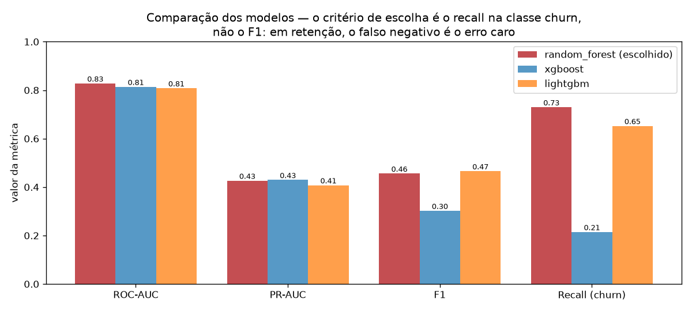

# Customer Churn MLOps Platform

Plataforma **ponta a ponta** para prever **churn** (cancelamento de clientes):
de dados a modelo servido em API, com dashboard interativo, tracking de
experimentos e containerização. Projeto de portfólio para **Cientista de Dados
Pleno**, com foco em qualidade de engenharia (testes, CI, reprodutibilidade).


> ⚠️ **Sobre os dados.** A base de clientes é **sintética**, gerada por
> [`src/data/generate_synthetic.py`](src/data/generate_synthetic.py). A escolha é
> deliberada: o objetivo é a **engenharia ponta a ponta** — ETL, features, tracking
> de experimentos, serviço e monitoramento — e não a descoberta de um sinal novo.
> Como o gerador planta os padrões que os modelos recuperam, **as métricas abaixo
> não são comparáveis a benchmarks de dado real**; leia-as como validação de que o
> pipeline funciona fim a fim, não como desempenho esperado em produção.

## Contexto de negócio
Reter é mais barato que adquirir, mas só compensa se a oferta de retenção chegar
**antes** do cancelamento e **na pessoa certa** — desconto para quem ia ficar é
margem jogada fora. O trabalho do modelo aqui é priorizar uma fila: dizer a quem
o time de retenção deve ligar primeiro, com quanto tempo de antecedência.

Isso muda a métrica. Numa base com ~27% de churn, **o falso negativo custa mais
caro que o falso positivo**: um cliente perdido leva junto todo o faturamento
futuro, enquanto um alarme falso custa uma ligação e, no pior caso, um desconto.
Por isso o modelo é escolhido por **recall na classe churn**, não por acurácia
nem por F1. Público-alvo: times de retenção em telecom e assinaturas.

## Stack
Python 3.12 · Pandas/NumPy · scikit-learn · XGBoost · LightGBM · SHAP ·
MLflow · FastAPI · Streamlit · SQLAlchemy/PostgreSQL · Docker · pytest

## Arquitetura
```
 generate_synthetic ──▶ ETL ──▶ PostgreSQL / parquet
        (dados)         │                 │
                        ▼                 ▼
              Feature Engineering ──▶ Treino RF/XGB/LGBM ──▶ MLflow (tracking)
              (charges_per_tenure,        │                      │
               buckets de tenure)         ▼                      ▼
                                    melhor modelo (.joblib)   SHAP (reports/)
                                          │
                        ┌─────────────────┴─────────────────┐
                        ▼                                     ▼
                  API FastAPI  ◀───── /predict ─────  Dashboard Streamlit
                 (/health, /predict)                 (KPIs + EDA + simulador)
```
Diagrama detalhado e decisões em [`reports/ARCHITECTURE.md`](reports/ARCHITECTURE.md).

## Resultados

Comparação de 3 modelos em holdout (20%, 8.000 clientes sintéticos, seed 42):

| Modelo | ROC-AUC | PR-AUC | F1 | Recall (churn) |
|---|---|---|---|---|
| **RandomForest** ✅ | **0.828** | 0.426 | 0.456 | **0.730** |
| XGBoost | 0.814 | 0.429 | 0.302 | 0.215 |
| LightGBM | 0.808 | 0.408 | 0.466 | 0.652 |



**RandomForest** foi escolhido: melhor ROC-AUC e, sobretudo, o maior **recall na
classe churn** (0.73) — em retenção, deixar de identificar quem vai cancelar
(falso negativo) custa mais caro do que um falso alarme.

O gráfico mostra por que o critério importa: **no F1 o vencedor seria outro**
(LightGBM, 0.47 contra 0.46), e pelo PR-AUC seria o XGBoost. Escolher pela
métrica errada aqui trocaria um modelo que captura 73% dos cancelamentos por um
que captura 65% — ou, no caso do XGBoost, apenas 21%. A métrica de seleção é uma
decisão de negócio, não um detalhe técnico.

Interpretação global do modelo via SHAP em
[`reports/shap_summary.png`](reports/shap_summary.png).

## Como rodar (local)
```bash
python -m venv .venv && source .venv/bin/activate
pip install -r requirements.txt

# 1) dados sintéticos  2) ETL  3) treino  4) explicabilidade
python -m src.data.generate_synthetic --n 8000 --seed 42
python -m src.data.etl
python -m src.models.train --n 8000 --seed 42
python -m src.models.explain

# API (http://localhost:8000/docs)
uvicorn app.main:app --reload

# Dashboard (http://localhost:8501) — com a API no ar
streamlit run app/dashboard.py

# Testes
pytest -q
```

### Exemplo de chamada à API
```bash
curl -X POST http://localhost:8000/predict -H "Content-Type: application/json" -d '{
  "tenure_months": 2, "monthly_charges": 95.0, "total_charges": 190.0,
  "contract": "Month-to-month", "internet_service": "Fiber optic",
  "payment_method": "Electronic check", "senior_citizen": 0, "partner": 0,
  "dependents": 0, "paperless_billing": 1, "tech_support": 0, "online_security": 0
}'
# -> {"churn_probability": 0.88, "churn": true, "threshold": 0.5}
```

## Como rodar (Docker)
```bash
python -m src.models.train      # gera models/churn_model.joblib
docker compose up --build       # Postgres + API (8000) + dashboard (8501)
```

## Estrutura
```
data/        dados brutos (CSV) e processados (parquet, SQLite)
src/data/    geração de dados sintéticos + ETL
src/features/ feature engineering + preprocessor
src/models/  treino/comparação (MLflow) + explicabilidade (SHAP)
app/         API (FastAPI) e dashboard (Streamlit)
notebooks/   EDA (01-eda.ipynb)
models/      modelo treinado (.joblib)
reports/     métricas, SHAP, diagrama e relatório técnico
tests/       testes automatizados (pytest)
```

## Decisões de projeto (trade-offs)
- **Dados sintéticos com sinal causal**: um modelo logístico latente gera o
  churn a partir das features, então as relações aprendidas fazem sentido de
  negócio e são auditáveis — sem depender de download de dataset externo.
- **PostgreSQL com fallback SQLite**: produção usa Postgres (`DATABASE_URL`);
  testes e CI rodam em SQLite, sem serviço externo.
- **Métrica de negócio > acurácia**: prioriza recall na classe churn.
- **MLflow em backend SQLite**: file store foi aposentado no MLflow 3.x;
  `MLFLOW_TRACKING_URI` permite apontar a um servidor em produção.
- **Pipeline único (preprocessor + modelo)**: treino e inferência aplicam
  exatamente a mesma transformação, eliminando *training/serving skew*.

## Status das etapas
- [x] 1 — Geração de dados sintéticos
- [x] 2 — ETL + carga no banco
- [x] 3 — EDA
- [x] 4 — Feature Engineering
- [x] 5 — Treino e comparação de modelos (MLflow + SHAP)
- [x] 6 — API FastAPI
- [x] 7 — Dashboard Streamlit
- [x] 8 — Docker + Compose
- [x] 9 — Testes, CI e documentação
